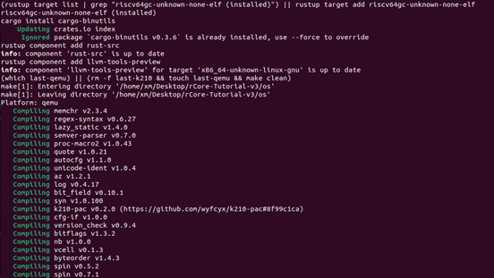

# 内核编译
## 使用VMware虚拟机进行本地OS开发  
可以选择安装Ubuntu22.04来进行环境配置

## 编译器及NPUcore内核编译过程  
NPUcore使用Rust语言编写而成，需要配置Rust的编译环境
1. 安装Rust版本管理器rustup和Rust包管理器cargo：
```shell
curl https://sh.rustup.rs -sSf | sh 
```
安装时注意选择nigthly版本，默认的是default版本   
输入以下命令来查看安装的rustup的版本，以验证是否成功安装：
```shell
rustc --version
```
若出现类似下面的输出，即代表安装成功
```shell
rustc 1.62.0-nightly (1f7fb6413 2022-04-10)
```
2. 安装Rust相关软件包
```shell
rustup target add riscv64gc-unknown-none-elf
cargo install cargo-binutils --vers =0.3.3
rustup component add llvm-tools-preview
rustup component add rust-src
```

3. 安装QEMU虚拟机  
NPUcore需要使用QEMU7.0.0版本，低版本的QEMU可能无法运行NPUcore。
可以选择下载QEMU的源码进行编译安装.

I) 安装编译QEMU源码所需的依赖包
```shell
sudo apt install autoconf automake autotools-dev curl libmpc-dev libmpfr-dev libgmp-dev \
              gawk build-essential bison flex texinfo gperf libtool patchutils bc \
              zlib1g-dev libexpat-dev pkg-config  libglib2.0-dev libpixman-1-dev libsdl2-dev \
              git tmux python3 python3-pip ninja-build
```

II) 下载QEMU源代码
```shell
wget https://download.qemu.org/qemu-7.0.0.tar.xz
```

III) 解压
```shell
tar xvJf qemu-7.0.0.tar.xz
```

IV) 编译安装并配置 RISC-V 支持
```shell
cd qemu-7.0.0
./configure --target-list=riscv64-softmmu,riscv64-linux-user
make -j$(nproc)
```

## makefile语法及文件构建
`make`是一个在软件开发中所使用的工具程序（Utility software），经由读取“makefile”的文件以自动化建构软件。它是一种转化文件形式的工具，转换的目标称为“target”；与此同时，它也检查文件的依赖关系，如果需要的话，它会调用一些外部软件来完成任务。它的依赖关系检查系统非常简单，主要根据依赖文件的修改时间进行判断。大多数情况下，它被用来编译源代码，生成结果代码，然后把结果代码连接起来生成可执行文件或者库文件。它使用叫做“makefile”的文件来确定一个target文件的依赖关系，然后把生成这个target的相关命令传给shell去执行。

许多现代软件的开发中（如Microsoft Visual Studio），集成开发环境已经取代make，但是在Unix环境中，仍然有许多工程师采用make来协助软件开发。

相关学习资料：
[Make命令教程](https://www.ruanyifeng.com/blog/2015/02/make.html)（易上手）
[跟我一起写makefile](https://seisman.github.io/how-to-write-makefile/overview.html)（描述全面）


## 内核编译过程体验
打开`os`目录后，执行`make`即可看到系统编译过程  
运行截图：


